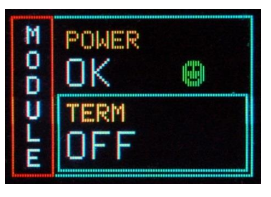

# N1470 remote control manual

### 1. Remote communication control section

- Fig.1 The remote control section

This section include three parts: IN , OUT and USB connectors. The module permits **RS485** and **RS232** port. In this page, **RS232** is used only. 

As is shown in Fig.1, three-pin cable for **RS232** connector is needed, where **RX** represents "Receive(rx) Data", **TX** for "Transmit(tx) Data" and **GND** for "ground". 

### 2. Connection

- Fig.2 RS232 communication

**IN** and **OUT** should be connected using the three-pin Dupont-Connector cables one by one where **TX RX** and **GND** must be connected. The last module need **turn on** the ***Termination*** as well as all modules need to **turn on** the ***Adaptation***.
 ### 3. Jumpers and switchs
 
 
 
 - Fig.3 Internal switch
 
a. In the Fig.3, the yellow boxs represent the ***Adaptation*** switches, and they must be pushed to the ***right hand*** for **RS232** communication and ***left hand*** for **RS485** communication. 
The red boxs represent the ***Termination*** switches, and they must be turn on for the last module for daisy chain purpose. This switch state can be checked in the module setting screen as is shown in Fig.4.

 
 
 - Fig.4 The termination state.
 
 b. The interlock control section is shown in Fig.5, there are four pin connector.
 **Short circuit pin 3 with pin 4** to close **INTERLOCK** mode when remote control is required.
 
 <figure class="half">
    
    
</figure>
 
 - Fig.5 The Interlock section and boards parameter.
 
 **For more details, please check the [N1470 user manual](./manual/N1470.pdf)**
 ### 4. Settings on PC
 
 -- Environment: Centos 7 with CERN ROOT
 
 The codes have been uploaded to [github](https://github.com/FanFei-Zeng/Data-Acquisition-System/tree/main/HV_N1470/code) which are developed by **Jianguo Wang**.
 
 - Firmware
 
 To ger start, one should download the firmware: [CAEN HV Wrapper](https://www.caen.it/download/?filter=CAEN%20HV%20Wrapper%20Library). Uzip the document and run the shell script *install.sh* as
 
 > ./install.sh
 
 - Compile
 
 Download the [codes](./code). Open a terminal in the source directory, run *make* in the command line, like
 
 > make
 
 - Configuration 
  
  
 
 - Fig.6 The setup for chain.
 
  The profile is named *setup.txt*. One should change the file for daisy chain purpose. As is shown in Fig.6, **ComPort** is the USB communication port, which should give a initial id, e.g. *ttyUSB0*. **BoundRate** should set a same value as in the module e.g. in Fig.7, the *9600* should be changed to *115200*. **Note**: all module should set the same boundrate and this value determines the vilocity of the communication. **BoardNum** represents the total number of modules. **ChainAddNum** is the id of each number, which should be consistent with the corresponding module. 
   
  
 
 - Fig.7 USB boundrate setup.
 
 The modual should set the control model as **REMOTE**.
 
 
 
 - Fig.8 The control mode.
 
 ### 5. Run
 
 If all the settings have been done. Switch to Superuser. 
 
 > su -
 
 Then, change the directory to the source directory and find the executable file **N1470** and run the project
 
 > ./N1470
 
 there will print a port number
 
 > **** localhost:8300 ****

Open the browser, and typing 

>localhost:8300

in the address bar and press ***Enter***, the program will run and one can change the settings of all modules remotely. As for remote control in the other PC, just change the *localhost:8300* to *IP:8300*, e.g. *192.168.0.101:8300*.

***Note: One can also use the software named [GECO2020](https://www.caen.it/download/?filter=GECO2020) developed by CAEN. To install and run the software, one can read the [manual](https://www.caen.it/download/?filter=GECO2020).***

 ## **All figures are copied from the CAEN N1470 User Manual.**
  
